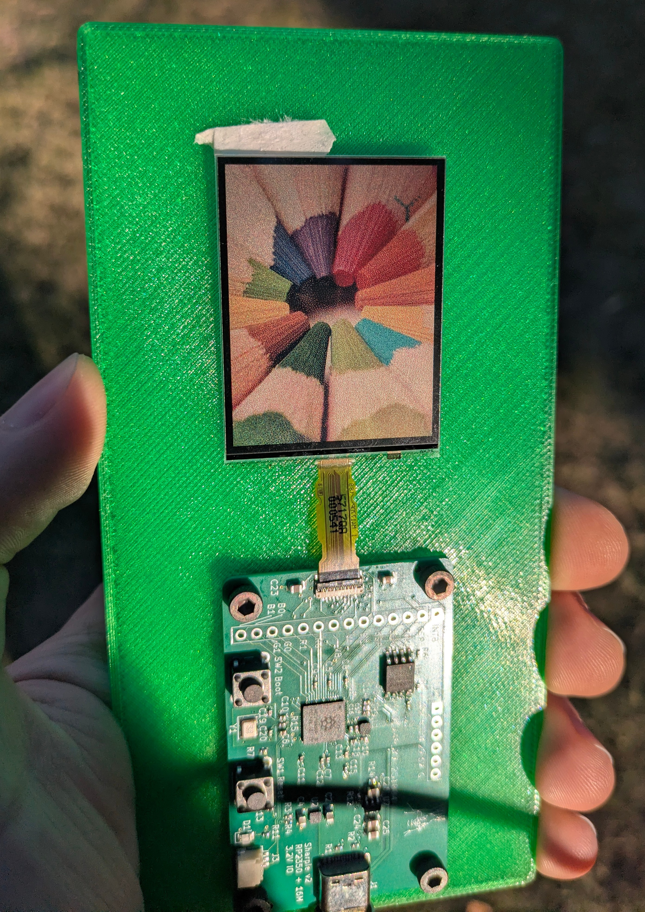

# Sharpie
Sharpie is a RP2350-based development board for Sharp color (not
monochrome!) memory-in-pixel (MiP) displays, using only the PIO
peripheral. It was originally built for the Sharp LS021B7DD02 display,
but should be compatible with any color MiP device made by Sharp. For
in-depth documentation and discussion, see the relevant blog posts [on
my website](https://cryothene.neocities.org).

Sharpie [plays](https://www.youtube.com/watch?v=W0dpXhKVE6Y)
[video](https://www.youtube.com/watch?v=7nzBJTZcFak) too!

## Repo contents
- `sharpie-cad`: a little bit of FreeCAD for a display/board carrier
- `sharpie-formatter`: an image formatter written in Rust that can
  dither and format images to binary data, ready to be written
  directly to the display
- `sharpie-hw`: the original revision of the hardware, with an extra
  voltage regulator and the display connector wired backward
- `sharpie-hw-rev2`: the second revision of the hardware, with that
  extra regulator removed and the display connector wired correctly
  (this is the revision that works)
- `sharpie-pictures`: assorted pictures of the project
- `sharpie-rp2040`: initial proof-of-concept for the PIO display
  interface, running on an RP2040 instead of an RP2350.
- `sharpie-sw`: the current demo software for a Sharpie rev2 board,
  and a nearly perfect **reference implementation** for using this
  work with a display
- `sharpie-usb-display`: an actually useful demo, which streams 4:3
  video over USB to a Sharpie board
- `vdp-simulator`: some proof-of-concept Rust code for how you could
  make a Sega-inspired tile-based video display processor in software

## Licensing
The hardware in `sharpie-hw` and `sharpie-hw-rev2` is licensed under
the CERN-OHL-W. A copy of this license is in `sharpie-hw-rev2`.

All software in this repository is licensed under the GPLv3, available
in `LICENSE` in the root.
