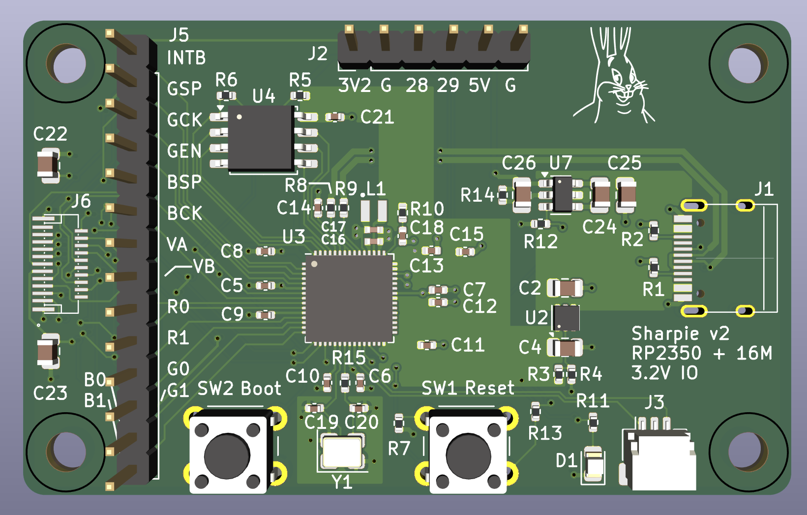

This directory exists because I wired the connector backwards on the
original Sharpie board. Rev2 of the board also drops the 3.3V regulator,
adds the RESET pull-up that I forgot, and has a nicer looking board.

There is a lot of duplicate stuff in this directory, because I copied
straight from the original sharpie-hw design.
